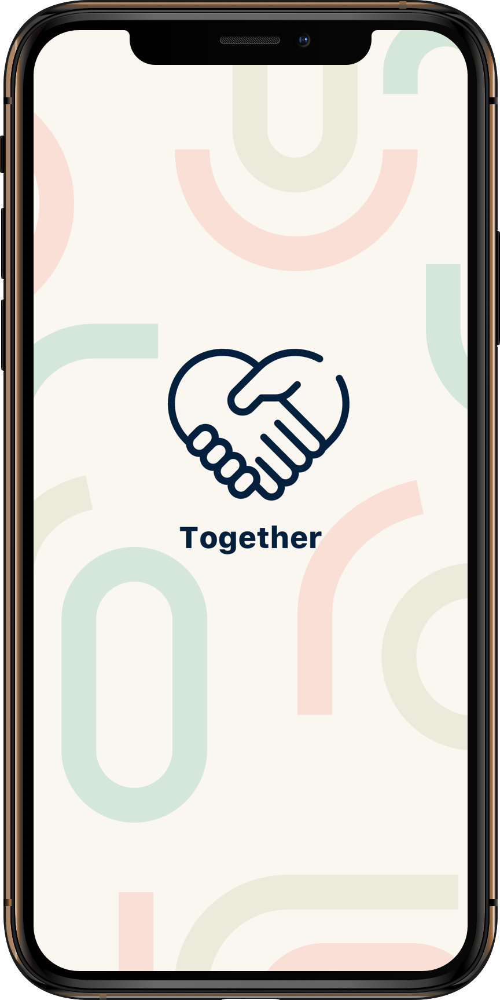
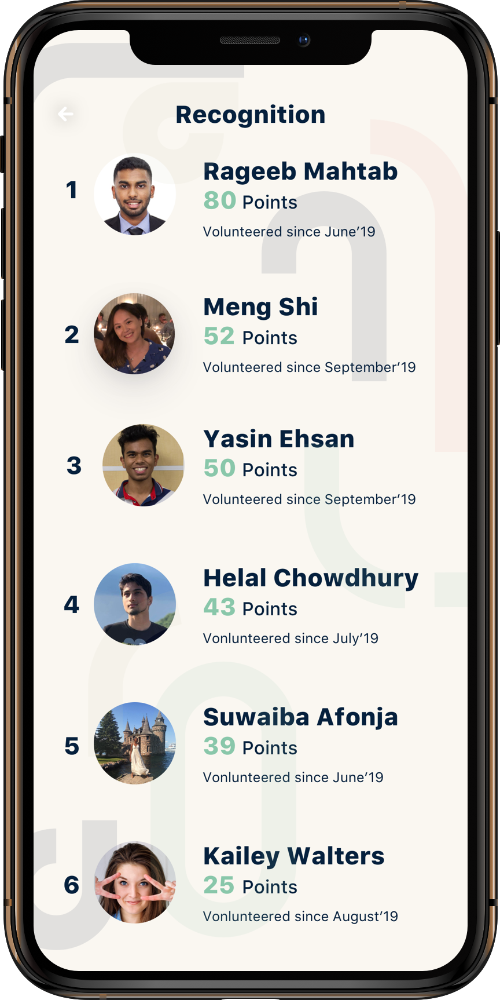
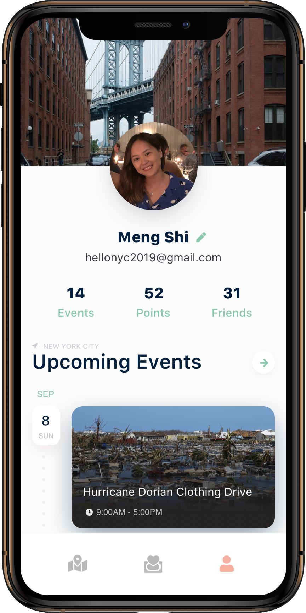
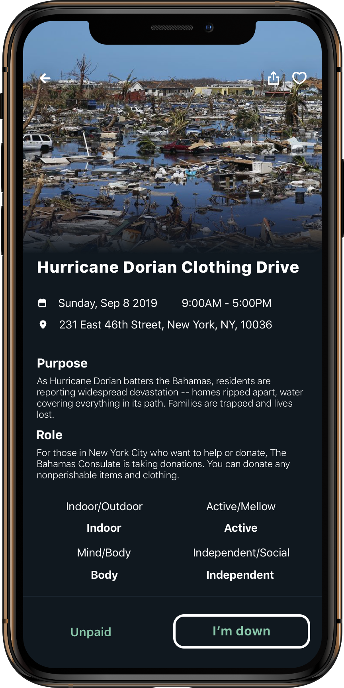
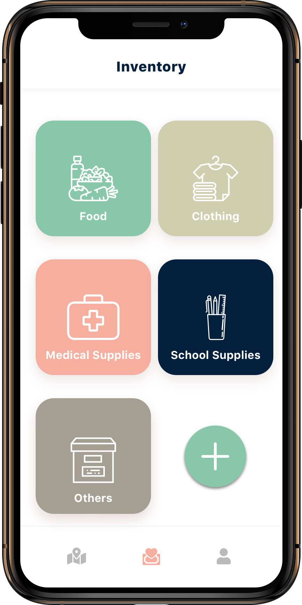

# Together

**About:** Connects users with NGO's to create an accessible and collaborative way to help make a difference in the community

**Built With:** Swift, Xcode, Zeplin, Google Cloud using MVC Software Pattern, IBM Watson Image Recognition, IBM Watson Assistant, and Kubernetes (IBM and Google Cloud)

**Frameworks:** UIKit, MapKit, CoreLocation, FlyoverKit, UserNotifications, EventKit, Contacts, Firebase, GoogleSignIn, Parse, Speech

## [Video Walkthrough](https://drive.google.com/file/d/15Emb15vuooPL-Ng8_mLbU2g3ckXF1Lmp/view?usp=sharing)

  
  <!--  -->
  <!--  -->

 

  
  <!--  -->
  <!--  -->

 

## Stand-Ups / Milestones
- [x] (Design) Wireframes
- [x] (Design) Zeplin components
- [x] (Native) Create boilerplate w rotating map
- [x] (Backend) Connect double segmented market to non-relational database
- [ ] (Native) Implement Apple Calnder and Apple Map transitions

## Roadblocks Overcame
- **Pull Requests** with differnt pod folders and stroyboard edits in different branches
- **Async calls** View Controller life cycle order of call between delegate and protocol methods
- **Geofence Limitation** Apple Places a limatation on tracking 20 physical barriers at a time
    - We came up w an algorithim that works around that limitation w/o eating the battery

## Useful Links
- [git ignore + storyboard merge conflict resolves](https://guides.codepath.com/ios/Using-Git-with-Terminal)
- [pod merge conflict](https://medium.com/@amlcurran/how-to-deal-with-conflicts-in-pod-folders-2eb9fa20f465)
- [Apple ML Kit](https://www.youtube.com/watch?v=p6GA8ODlnX0)
- [IBM Cloud](https://cloud.ibm.com/)

## Team
- Backend: **Yasin Ehsan**, Queens College
- Native: **Helal Chowdhury**, NYU
- Backend: **Rageeb Mahtab**, Baruch
